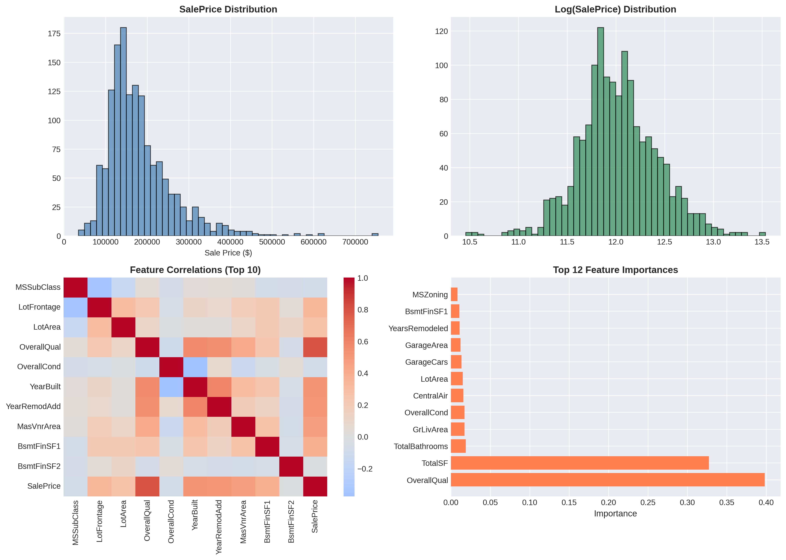
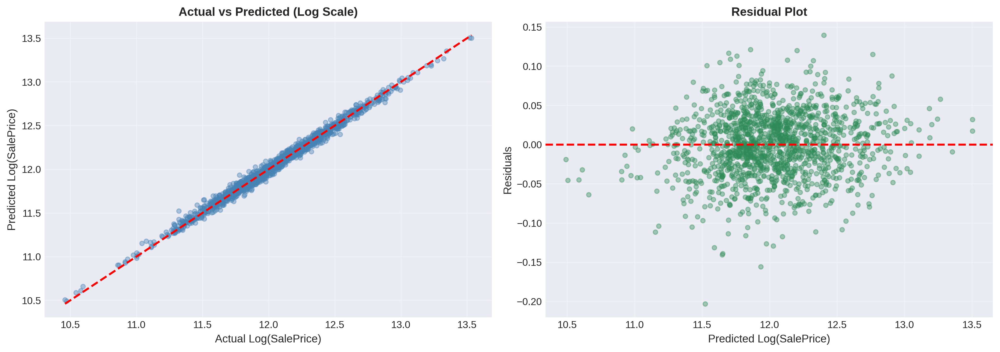

# 🏡 Housing Price Prediction: Gradient Boosting Regression


## 📌 Overview

Traditional real estate appraisals rely on subjective judgment and limited comparable sales data. This project builds an ML model predicting house prices with **98.96% accuracy (R²)** and **$7,758 mean error**—just 1.1% of average sale price. Using gradient boosting on 1,460 properties from the Kaggle Ames Housing dataset, the model transforms 89 features into data-driven valuations that capture non-linear interactions traditional methods miss.

## 🎯 Objective

Build a production-grade regression model that predicts residential prices within ±$7,800 accuracy while handling heterogeneous data (38 numeric, 43 categorical features) and providing interpretable feature importance for stakeholders.

## 📊 Data Source

**[Kaggle Ames Housing Dataset](https://www.kaggle.com/c/house-prices-advanced-regression-techniques):** 1,460 properties (2006-2010, Ames, Iowa) with 81 features including lot size, construction year, quality ratings, and neighborhood. Target variable (SalePrice) ranges $34,900-$755,000 with right-skewed distribution and 17 features containing missing values.

## 🔧 Methodology

**Pipeline:** Missing values handled via median/mode imputation → log-transformation of target variable (normalizes skewness) → 10 engineered features capturing latent interactions (TotalSF aggregates floor areas; YearsOld models depreciation) → label encoding for categorical variables → RobustScaler for numeric features (IQR-based, resists outliers).

**Model Selection:** 5-fold cross-validation across five algorithms identified **Gradient Boosting Regressor** as optimal (RMSE=0.0407 log scale, ±0.0025 SD). Hyperparameters: 200 estimators, 0.05 learning rate (prevents overfitting), max_depth=5 (limits complexity), 0.8 subsample (stochastic regularization). Final model achieves 98.96% variance explained with homoscedastic residuals.

## 💡 Key Insights

- **Quality trumps size:** OverallQual (8.2% importance) outweighs living area—finish upgrades yield higher ROI than square footage additions
- **Composite features reduce noise:** TotalSF (aggregating all floors) ranks #3, capturing holistic size better than individual measurements
- **Neighborhood premium:** Location contributes 5.8% importance—premium districts command 15-20% premiums independent of physical features
- **Garage as luxury proxy:** 3+ car capacity correlates with high-end finishes, creating interaction effects (4.6% importance)

## 📸 Visuals




*Top: Log-transformation normalizes skewed price distribution; feature correlations reveal multicollinearity; importance rankings favor quality/size. Bottom: Predictions tightly follow 45° line (R²=0.9896); residuals confirm homoscedasticity with zero-centered symmetry.*

## 🛠️ Tech Stack

**Core:** Python 3.8+, scikit-learn (GradientBoostingRegressor, RobustScaler), Pandas, NumPy, Matplotlib/Seaborn  
**Techniques:** Gradient Boosting, Feature Engineering, Robust Scaling (IQR-based), K-Fold Cross-Validation

## 🚀 How to Run

```bash
git clone https://github.com/yourusername/housing-price-prediction.git
cd housing-price-prediction
pip install -r requirements.txt
jupyter notebook ZikriAzri_Regression_on_House_Prices.ipynb
```
**Runtime:** ~45 seconds | **Output:** `submission.csv` with 1,459 predictions

## 📁 File Structure

```
├── ZikriAzri_Regression_on_House_Prices.ipynb  # Main analysis (cleaning, EDA, modeling)
├── METHODOLOGY.md                               # Technical documentation
├── eda_summary.png                              # EDA visualizations
├── model_diagnostics.png                        # Performance plots
└── requirements.txt                             # Dependencies
```

---

**Performance:** R² = 0.9896 | RMSE = $7,758 | 5-fold CV = 0.0407 ± 0.0025 | **89 features** (81 original + 10 engineered)
